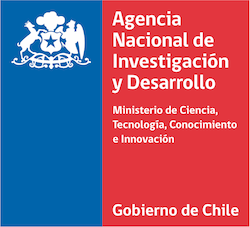

# Polinización en la escuela :hibiscus: :bee:

## Llevando la polinización a la escuela

En el marco del proyecto [SURPASS2](https://bee-surpass.org), desarrollamos un marco de trabajo en **Ciencia ciudadana** para acercar a la gente al mundo de los polinizadores y comprender la importancia de la polinización en nuestra vida cotidiana. En este sentido, decidimos crear este material para introducir a profesores y estudiantes de enseñanza media en el tema mediante actividades lúdicas que estimulen el aprendizaje de conceptos clave mediante juegos y actividades al aire libre.

### Financiamiento

Este trabajo fue financiado por la Agencia Nacional de Investigación y Desarrollo ([ANID](https://www.anid.cl)), mediante el proyecto de Cooperación Internacional **NE/S011870/1**, ejecutado en Chile 🇨🇱 por la Pontificia Universidad Católica de Valparaíso, la Universidad de La Frontera, la Universidad Mayor, la Universidad de Los Lagos, y la Universidad Metropolitana de Ciencias de la Educación.

### Importante

Este material es distribuido de forma gratuita bajo una licencia de tipo **Creative Commons BY-NC-SA**. Esto implica que el material puede ser utilizado y adaptado libremente, siempre y cuando se mencione la fuente original y no sea comercializado de ninguna forma. Los materiales derivados de las adaptaciones que se realicen deben ser distribuidos bajo el mismo tipo de licencia. Para más información acerca de la licencia Creative Commns, lea [este artículo](https://creativecommons.cl/tipos-de-licencias/).

