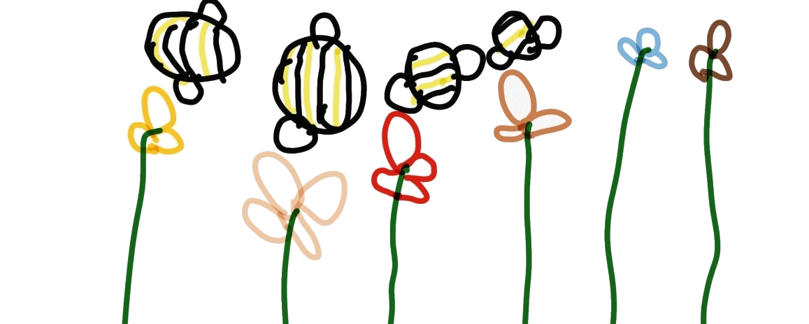
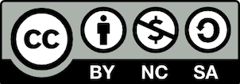

# Polinización en la escuela :hibiscus: :bee:

## Llevando la polinización a la escuela :woman_student:

 

En el marco del proyecto [SURPASS2](https://bee-surpass.org), desarrollamos un marco de trabajo en **Ciencia ciudadana** para acercar a la gente al mundo de los polinizadores y comprender la importancia de la polinización en nuestra vida cotidiana. En este sentido, decidimos crear este material para introducir a profesores y estudiantes de enseñanza media en el tema mediante actividades lúdicas que estimulen el aprendizaje de conceptos clave mediante juegos y actividades al aire libre.

El material fue desarrollado por **Javiera Villarroel Rojas**, profesora de biología y ciencias naturales, asociada a la Pontificia Universidad Católica de Valparaíso en el marco del proyecto NE/S011870/1. El proceso de desarrollo del material contó con la colaboración de Maureen Murúa (Universidad Mayor), Luis Flores (UMCE), y Lorena Vieli (Universidad de La Frontera). La coordinación general y elaboración de este repositorio estuvo a cargo de [Francisco E. Fontúrbel](https://github.com/fonturbel).

**[VER COMO PÁGINA WEB](https://fonturbel-lab.github.io/polinizacion_escuela/)** :desktop_computer:

### Contenido :books:

Este repositorio contiene cinco documentos (los que se pueden encontrar dentro la carpeta _material_ de este repositorio):

(1) **Guia_trabajo.docx** - Formulario para completar los datos relacionados con los trabajos a desarrollar y sus objetivos.

(2) **Indicadores.docx** - Indicadores de aprendizaje asociados al currículo nacional de enseñanza media.

(3) **Rubrica_docente.docx** - Pauta de evaluación grupal e individual.

(4) **Orientacion_docente.pptx** - Presentación autoexplicativa del material y las actividades a realizar, dirigida a los docentes.

(5) **Sesiones.pptx** - Presentación para los estudiantes.

El paquete completo puede ser descargado [acá](./paquete.zip) en forma de un archivo zip.

### ¿Cómo usar este material? :brain:

El primer paso es descargar el material. Una vez hecho esto, los profesores deben revisar los indicadores y el material de orientación docente. Siéntanse libres de adaptar el material a las necesidades de su curso y al contexto donde se realizarán las actividades. Particularmente, la presentación para los estudiantes contiene una serie de diapositivas de ejemplo sobre polinizadores para la zona norte (diapositivas 5 a 7), centro (diapositivas 8 a 13) y sur (diapositivas 14 a 18) de Chile; para cada caso, se deben conservar solamente las diapositivas apropiadas para el lugar donde se realiza la actividad, y eliminar las de las otras zonas.

### Contribuciones a este material :handshake:

Dado que la ciencia y la enseñanza son dinámicas y están en constante cambio, estamos abiertos a recibir contribuciones a este material de parte de terceros. Para ello, debe realizar una copia del repositorio a su cuenta de GitHub usando la función _Fork_ y posteriormente enviar la contribución mediante _Pull request_. Las contribuciones no solicitadas serán revisadas antes de ser incorporadas.

### Financiamiento :moneybag:

Este trabajo fue financiado por la Agencia Nacional de Investigación y Desarrollo ([ANID](https://www.anid.cl)), mediante el proyecto de Cooperación Internacional **NE/S011870/1**, ejecutado en Chile 🇨🇱 por la Pontificia Universidad Católica de Valparaíso, la Universidad de La Frontera, la Universidad Mayor, la Universidad de Los Lagos, y la Universidad Metropolitana de Ciencias de la Educación.

### Importante :warning:

Este material es distribuido de forma gratuita bajo una licencia de tipo **Creative Commons BY-NC-SA**. Esto implica que el material puede ser utilizado y adaptado libremente, siempre y cuando se mencione la fuente original y no sea comercializado de ninguna forma. Los materiales derivados de las adaptaciones que se realicen deben ser distribuidos bajo el mismo tipo de licencia. Para más información acerca de la licencia Creative Commns, lea [este artículo](https://creativecommons.cl/tipos-de-licencias/).

